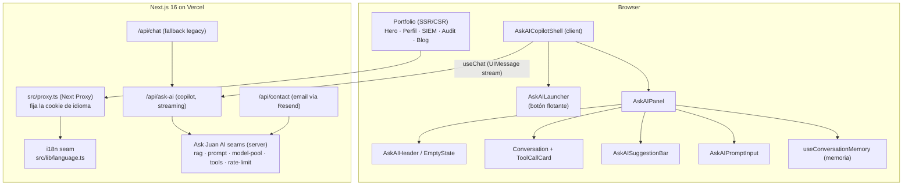
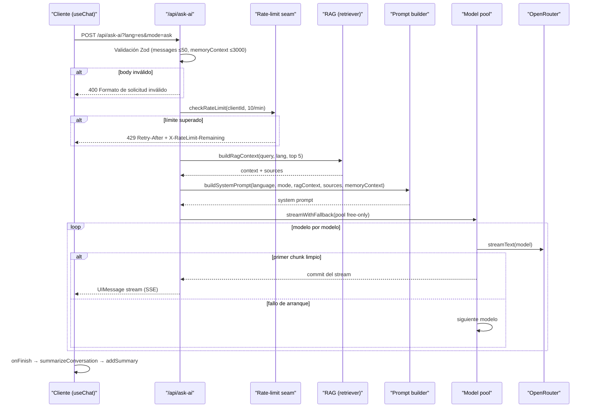
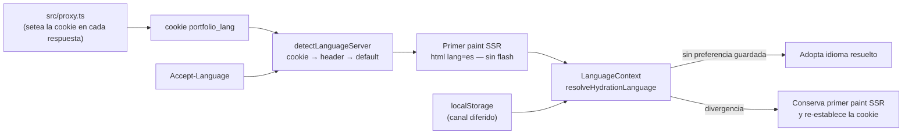
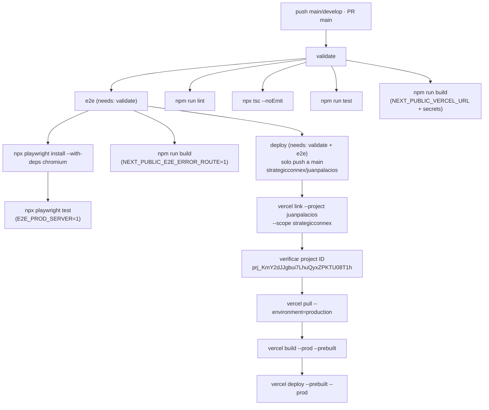

# Juan Felipe Palacios — Portfolio IT/OT

Portfolio de consultoría en **ciberseguridad industrial, IT/OT y redes para Oil & Gas** (Vaca Muerta, Neuquén, Argentina). Incluye un dashboard SIEM simulado, visualización del modelo Purdue, hub de compliance, sección de producto SaaS (StrategicAudit Pro), blog técnico y un **AI Cybersecurity Copilot bilingüe** con RAG del propio portfolio.

**URL de producción:** `https://juanpalacios.vercel.app`

---

## Stack Tecnológico

| Capa | Tecnología |
|---|---|
| Framework | Next.js 16 (App Router + Turbopack), React 19, TypeScript 6 |
| Estilos | Tailwind CSS v4, Framer Motion, Three.js + @react-three/fiber, tsparticles |
| AI | Vercel AI SDK v7 (`ai`, `@ai-sdk/react`, `@ai-sdk/openai`), OpenRouter, Streamdown (Markdown) + Shiki |
| UI | shadcn/ui, Lucide Icons, use-stick-to-bottom |
| RAG | Keyword scoring + TF-IDF cosine (fusionado, sin vector DB) |
| State | Zustand (UI), Context API (i18n), localStorage (persistencia) |
| Datos | Zod (validación), Resend (email) |
| Rate limiting | Upstash Redis + fallback in-memory |
| Observabilidad | PostHog (analytics), Sentry (errores), StrategicAudit RUM |
| Testing | Vitest + Testing Library + axe-core (unit), Playwright (e2e) |
| CI/CD | GitHub Actions (validate + e2e), Husky + lint-staged |

---

## Arquitectura General

```
┌──────────────────────────────────────────────────────────────────────┐
│ Browser                                                              │
│  ┌─────────────┐   ┌──────────────────────────────────────────────┐  │
│  │ Portfolio    │   │ AskAICopilotShell (client)                  │  │
│  │ (SSR/CSR)    │   │  ├─ AskAIErrorBoundary                     │  │
│  │ Hero, Perfil │   │  ├─ AskAILauncher (botón flotante)         │  │
│  │ Arquitectura │   │  └─ AskAIPanel                              │  │
│  │ Experiencia  │   │      ├─ AskAIHeader / EmptyState           │  │
│  │ SIEM, Audit  │   │      ├─ Conversation + ToolCallCard        │  │
│  │ SCAudit, Blog│   │      ├─ AskAISuggestionBar                 │  │
│  │ Stack, Certs │   │      └─ AskAIPromptInput                    │  │
│  │ Proyecto     │   │      └─ useConversationMemory (memoria)     │  │
│  └──────┬───────┘   └──────────────────┬─────────────────────────┘  │
│         │                              │ useChat (UIMessage stream) │
└─────────┼──────────────────────────────┼────────────────────────────┘
          │                              │
          ▼                              ▼
┌──────────────────────────────────────────────────────────────────────┐
│ Next.js 16 on Vercel                                                 │
│  ┌──────────────┐   ┌────────────────────────────────────────────┐  │
│  │ src/proxy.ts │   │ API routes                                  │  │
│  │ (Next Proxy) │   │  /api/ask-ai  (copilot, streaming)         │  │
│  │  - fija la   │   │  /api/contact (email vía Resend)           │  │
│  │    cookie    │   │  /api/chat   (fallback legacy → ask-ai)    │  │
│  │    de idioma │   └───────────────┬────────────────────────────┘  │
│  └──────┬───────┘                   │                               │
│         │                           ▼                               │
│  ┌──────┴──────────────┐  ┌─────────────────────────────────────┐  │
│  │ i18n seam           │  │ Ask Juan AI seams (server)          │  │
│  │ src/lib/language.ts │  │  rag/retriever.ts  (RAG unificado)  │  │
│  │ cookie → header →   │  │  rag/sources.ts    (corpus derivado)│  │
│  │ default (ES/EN)     │  │  rag/tokenizer.ts  (stop-words)     │  │
│  └─────────────────────┘  │  prompt/system-prompt.ts (prompt)   │  │
│                           │  model-pool.ts       (fallback real) │  │
│                           │  tools/registry.ts   (6 tools)      │  │
│                           │  rate-limit.ts       (Upstash+mem)  │  │
│                           └─────────────────────────────────────┘  │
└──────────────────────────────────────────────────────────────────────┘
```

**Versión Mermaid** (renderiza en GitHub):



### Seams (módulos profundos — ver `CONTEXT.md`)

| Seam | Módulo | Responsabilidad |
|---|---|---|
| **Detección de idioma** | `src/lib/language.ts` + `src/proxy.ts` | Regla única *cookie → Accept-Language → default*; el proxy garantiza `portfolio_lang` en cada respuesta de página (el layout no puede setear cookies en Server Components) |
| **Retrieval (RAG)** | `src/lib/ask-ai/rag/retriever.ts` | `retrieve()` fusiona keyword + TF-IDF (normalizados 0–100, pesos 0.6/0.4); contexto y lista de fuentes salen de la misma retrieval |
| **Tokenizer** | `src/lib/ask-ai/rag/tokenizer.ts` | `tokenize()` + `STOP_WORDS` (interrogativos ES/EN incluidos) |
| **Corpus** | `src/lib/ask-ai/rag/sources.ts` | Proyección derivada de `src/data/*` + traducciones (per-locale `es`/`en`, nunca `both` con contenido español) |
| **Rate limit** | `src/lib/rate-limit.ts` | `checkRateLimit()` async: Upstash Redis con fallback in-memory; `getClientId()` lee la **última** IP de `x-forwarded-for` (ADR-001) |
| **Prompt builder** | `src/lib/ask-ai/prompt/system-prompt.ts` | `buildSystemPrompt()` + `buildToolDescriptions()` (templates bilingües, opción `memoryContext`) |
| **Model pool** | `src/lib/ask-ai/model-pool.ts` | `streamWithFallback()`: lee el primer chunk del stream antes de comprometerse (fallback real — `streamText` no lanza en la llamada); todo el pool falla → 503 |
| **Memoria** | `src/lib/ask-ai/memory/` | Client-side: `summarizeConversation` → `addSummary` en `onFinish`; `buildMemoryContext()` viaja en el body (cap 3000) y se embebe en el system prompt |

---

## Flujo del AI Copilot (`POST /api/ask-ai`)

```
Cliente (useChat)  ──POST──▶  /api/ask-ai?lang=es&mode=ask
                                   │
                                   ▼
                       1. Validación Zod (messages ≤50, memoryContext ≤3000)
                                   │
                                   ▼
                       2. Rate limit: checkRateLimit(clientId, 10/min)
                                   │ 429 → Retry-After + X-RateLimit-Remaining
                                   ▼
                       3. RAG: buildRagContext(última query del usuario, lang, top 5)
                                   │  corpus proyectado per-locale
                                   ▼
                       4. Prompt: buildSystemPrompt({ language, mode, ragContext,
                                   │            sources, memoryContext })
                                   ▼
                       5. Model pool: streamWithFallback(pool free-only → 503 si todo falla)
                                   │  commit al primer stream que arranca limpio
                                   ▼
                       6. UIMessage stream (SSE)  ──▶  Cliente (streaming Markdown)
                                   │
                                   └─ onFinish → summarizeConversation → addSummary
```

**Versión Mermaid** (renderiza en GitHub):



### Pool de modelos (OpenRouter)

| Orden | Modelo | Env var |
|---|---|---|
| 1–6 | Pool **free-only** (`:free`, costo $0 — invariante en código) | `OPENROUTER_MODEL_POOL` |

El copilot **siempre usa modelos gratis**: no existe fallback pago. `buildFreeModelPool()`
descarta cualquier entrada que no termine en `:free` (o el router `openrouter/free`,
usado como red de seguridad al final del pool); si tras el saneamiento el pool queda
vacío, responde **503** en vez de gastar dinero. Un modelo cuenta como fallido solo si
su stream **falla al arrancar** (read rechazado, stream vacío, primer evento SSE
`{"type":"error"}` o 429 de rate limit). Errores mid-stream no se reintentan
(requeriría buffering). El modelo ganador viaja al cliente como metadata del stream
y el panel lo muestra con su **latencia percibida** (ej. `gemma-4-31b-it · 1.4s · gratis`).
Cuando el primer modelo del pool falló y respondió un modelo posterior, el badge se
marca en **ámbar con un icono de fallback** (con tooltip explicativo).
Si un stream se corta a mitad, el panel **reintenta automáticamente** (máx. 2 por
respuesta) con el siguiente modelo del pool, enviando `skipModels` (los ids que
fallaron mid-stream) para no repetirlos; si los skips vacían el pool, la ruta
responde 503.

Los modelos free de OpenRouter tienen rate limit (20 req/min por cuenta, límites
por modelo más estrictos), así que un **429 al arrancar el stream** no salta
directo al siguiente modelo: el modelo entra en una **cola de reintentos con
backoff exponencial** (±50% de jitter, 600ms → 1200ms, máx. 2 reintentos por
modelo) antes de avanzar, con un **presupuesto global de 5s** para que el pool
quede dentro del `maxDuration` de la ruta (30s). Solo al agotar los reintentos el
pool avanza al siguiente modelo.

El **health-check del pool se persiste en localStorage** (`ask-ai-failed-models`, con
TTL de 24h): los modelos que fallaron mid-stream en visitas anteriores arrancan
skippeados desde el primer mensaje de la siguiente visita. La lista se auto-cura:
cada fallo nuevo desliza el reloj del TTL, y un modelo que dejó de fallar se
vuelve a probar al expirar su entrada (los rate limits de los free se resetean
a diario).

### Herramientas (pasivas)

`dnsAnalyzer` · `sslChecker` · `httpHeadersAnalyzer` · `whoisLookup` · `techStackDetector` · `portAnalyzer` — todas con Zod schema, `safe-fetch` (bloqueo de IPs privadas/SSRF) y tarjetas de resultado dedicadas en `src/components/ask-ai/tools/`.

---

## Skeleton del Proyecto

```
src/
├── proxy.ts                      # Next 16 Proxy: garantiza cookie de idioma
├── app/
│   ├── layout.tsx                # SSR i18n, JSON-LD, SCAudit RUM, Observability
│   ├── page.tsx                  # Composición home (secciones lazy + Suspense)
│   ├── loading.tsx / error.tsx / not-found.tsx
│   ├── robots.ts / sitemap.ts
│   ├── test-error/               # Solo con NEXT_PUBLIC_E2E_ERROR_ROUTE=1
│   └── api/
│       ├── ask-ai/route.ts       # Copilot (streaming + RAG + tools + pool)
│       ├── contact/route.ts      # Formulario → Resend (rate limit 5/min)
│       └── chat/route.ts         # Fallback legacy → reenvía a /api/ask-ai
├── components/
│   ├── Hero, Perfil, Arquitectura (Purdue), Experiencia, TrustBadges,
│   │   SIEMDashboard, AuditHub, SCAudit, Blog, Stack, Certificaciones,
│   │   Proyecto, Contacto, Footer, Navbar, HtmlLangUpdater
│   ├── ask-ai/                   # Copilot UI (shell, launcher, panel, header,
│   │   │                         #   prompt-input, suggestion bar, empty state,
│   │   │                         #   status pill, error boundary)
│   │   └── tools/                # ToolCallCard + 6 tarjetas de resultado
│   ├── ai-elements/              # Conversación, mensajes, sources, prompt-input
│   │                             #   (componentes propios, render con Streamdown)
│   ├── observability/            # ObservabilityProvider (PostHog + Sentry)
│   └── ui/                       # shadcn/ui primitives
├── context/
│   ├── LanguageContext.tsx       # Proveedor i18n (usa el seam de idioma)
│   └── translations/             # Diccionarios ES/EN por sección (19 archivos)
├── data/                         # Contenido: siem, audit, blog, experiencia,
│                                 #   mindmap, caseStudyData
├── lib/
│   ├── language.ts               # Seam de detección de idioma
│   ├── rate-limit.ts             # Seam de rate limiting
│   ├── constants.ts / utils.ts
│   ├── observability/            # posthog.ts, sentry.ts
│   └── ask-ai/
│       ├── rag/                  # retriever, sources, tokenizer
│       ├── prompt/               # system-prompt
│       ├── model-pool.ts
│       ├── memory/               # conversation-memory + use-conversation-memory
│       └── tools/                # registry + 6 tools + safe-fetch
├── stores/ask-ai-store.ts        # Zustand: isOpen, mode
└── test-utils/                   # Mocks de framer-motion y next/image
```

---

## Internacionalización (ES/EN)

```
SSR:  cookie portfolio_lang → Accept-Language → 'es'  (detectLanguageServer)
        │  src/proxy.ts setea la cookie en cada respuesta de página
        ▼
Primer paint:  <html lang="es"> (layout)  ── sin flash ──
        │
Hidratación:  LanguageContext → resolveHydrationLanguage(cookie, localStorage)
        │  - sin preferencia guardada → adopta el idioma resuelto
        │  - divergencia → conserva el primer paint SSR y re-establece la cookie
        ▼
localStorage = canal diferido de preferencia (nunca pisa el primer paint)
```

**Versión Mermaid** (renderiza en GitHub):



El seam vive en `src/lib/language.ts`; el layout (SSR), el proxy (cookie) y el `LanguageContext` (post-hidratación) lo consumen sin re-derivar la regla.

---

## API Routes

| Ruta | Método | Descripción | Protección |
|---|---|---|---|
| `/api/ask-ai` | POST | Streaming del copilot con RAG + tools + model pool | Rate limit 10/min, Zod, cap memoryContext 3000 |
| `/api/contact` | POST | Envía el formulario de contacto por email (Resend) | Rate limit 5/min, Zod (`contactSchema`), escape HTML |
| `/api/chat` | POST/GET | Fallback legacy que reenvía a `/api/ask-ai` propagando el XFF/x-real-ip del edge (H2) | — |

---

## Desarrollo Local

```bash
# 1. Instalar dependencias
npm install

# 2. Configurar variables de entorno (copiar plantilla)
cp .env.example .env.local
#   Editar .env.local con tus API keys (ver tabla abajo)

# 3. Iniciar dev server (http://localhost:3000)
npm run dev
```

### Scripts

| Comando | Descripción |
|---|---|
| `npm run dev` | Dev server (Turbopack) |
| `npm run build` | Build de producción |
| `npm start` | Sirve el build (`next start`) |
| `npm run lint` | ESLint |
| `npm run typecheck` | `tsc --noEmit` |
| `npm test` | Vitest (unit/integration) |
| `npm run test:watch` | Vitest en watch |
| `npm run test:e2e` | Playwright e2e |

### Variables de Entorno

Plantilla en `.env.example`. Las principales:

| Variable | Requerida | Descripción |
|---|---|---|
| `OPENROUTER_API_KEY` | ✅ | API key de OpenRouter (copilot) |
| `RESEND_API_KEY` | ✅ (contacto) | API key de Resend para el formulario |
| `CONTACT_TO_EMAIL` / `CONTACT_FROM_EMAIL` | ✅ (contacto) | Destinatario y remitente del email |
| `OPENROUTER_MODEL_POOL` | ❌ | Pool de modelos **free-only** separado por comas (solo ids `:free` o `openrouter/free`; cualquier otro se descarta) |
| `UPSTASH_REDIS_REST_URL` / `UPSTASH_REDIS_REST_TOKEN` | ❌ | Rate limit distribuido (sin ellos: in-memory) |
| `NEXT_PUBLIC_POSTHOG_KEY` / `NEXT_PUBLIC_POSTHOG_HOST` | ❌ | Analytics PostHog |
| `SENTRY_DSN` | ❌ | Error tracking Sentry |
| `NEXT_PUBLIC_VERCEL_URL` | ❌ | Dominio desplegado (default `juanpalacios.vercel.app`) |
| `NEXT_PUBLIC_E2E_ERROR_ROUTE` | ❌ | Arma `/test-error` solo para el e2e del error boundary (CI) |

**Secret de GitHub necesario para el deploy automático** (Settings → Secrets and variables → Actions):

| Secret | Descripción |
|---|---|
| `VERCEL_TOKEN` | Token de API de Vercel (cuenta → Settings → Tokens, o `vercel tokens add`) |

> El proyecto destino está **fijado en el workflow**: team `strategicconnex`, project `juanpalacios` (ID `prj_KmY2dJJgbui7LhuQyxZPKTU08T1h`). El job `deploy` vincula por nombre/team y **falla el build si el project ID vinculado no es el esperado** (nunca despliega a otro proyecto).
>
> Las env vars de runtime (`OPENROUTER_API_KEY`, `RESEND_API_KEY`, `CONTACT_TO_EMAIL`, `CONTACT_FROM_EMAIL`) se configuran **una sola vez en el dashboard de Vercel** (Settings → Environment Variables → Production); `vercel pull` las baja al build. Los secrets de GitHub solo se usan como fallback del build local de CI.

---

## Testing

### Unit / Integración (Vitest — jsdom)

```bash
npm test            # 34 archivos · 353 tests
```

Cobertura por área (los seams son el test surface):

| Área | Tests clave |
|---|---|
| RAG (retriever + tokenizer + sources) | Goldens de ranking, stop-words, no-drift del corpus proyectado |
| Seam de idioma | Detección server/client, resolución de hidratación, no-flash |
| Rate limit | Ventana in-memory, adaptador Upstash, fallback, contrato ADR-001 |
| Prompt builder / Model pool | Prompts ES/EN, memoryContext, fallback real sobre primer chunk |
| Memoria | `summarizeConversation`, hook conector, persistencia |
| Ruta ask-ai | Payload RAG en system prompt, mode/tools, cap memoryContext, 400/429/503 |
| Ruta contact | Validación Zod, email HTML, rate limit |
| Componentes | Hero, Navbar, Stack, Blog, SIEM, SCAudit, Certificaciones, accesibilidad (axe) |

### E2E (Playwright — Chromium)

```bash
npm run test:e2e                    # contra dev server (reusa el puerto 3000)
npm run build && PORT=3100 E2E_PROD_SERVER=1 npm run test:e2e   # contra build prod
```

7 specs · 33 tests: `landing`, `nav`, `hero`, `app-shell` (loading/error/not-found), `ask-ai` (panel), `contact` + `contact-form` (formulario contra la ruta real).

### CI/CD (GitHub Actions — `.github/workflows/ci.yml`)

```text
validate  (push main/develop, PR main)
  ├─ npm ci
  ├─ npm run lint
  ├─ npx tsc --noEmit
  ├─ npm run test
  └─ npm run build   (con NEXT_PUBLIC_VERCEL_URL + secrets)

e2e  (needs: validate)
  ├─ npm ci
  ├─ npm run build   (con NEXT_PUBLIC_E2E_ERROR_ROUTE=1)
  ├─ npx playwright install --with-deps chromium
  └─ npx playwright test  (E2E_PROD_SERVER=1)

deploy  (needs: validate + e2e — solo push a main)
  ├─ npm ci
  ├─ vercel link --yes --project juanpalacios --scope strategicconnex
  ├─ verificar project ID == prj_KmY2dJJgbui7LhuQyxZPKTU08T1h  (hard-fail)
  ├─ vercel pull --yes --environment=production
  ├─ vercel build --prod         (--prebuilt: build en el runner)
  └─ vercel deploy --prebuilt --prod
```

Cada push a `main` que pase `validate` + `e2e` despliega automáticamente a producción en Vercel (sin doble build gracias a `--prebuilt`). El job `deploy` también se puede disparar manualmente desde Actions (`workflow_dispatch`) sobre `main`.

**Versión Mermaid** (renderiza en GitHub):



---

## Producción y Seguridad

- **CSP estricta** en `next.config.ts` (`default-src 'self'`; solo Vercel, SCAudit, PostHog, Sentry, OpenRouter; `frame-ancestors 'self'`).
- **Headers**: HSTS (preload), X-Frame-Options, X-Content-Type-Options, Referrer-Policy, Permissions-Policy.
- **SSRF protection**: `safe-fetch.ts` valida URLs y bloquea IPs privadas en las tools.
- **Rate limiting**: seam único (Upstash + fallback in-memory), `getClientId` anti-spoofing (última IP de XFF — ADR-001).
- **Anti-spoofing de IP**: `/api/chat` no reenvía headers `X-Forwarded-For`/`X-Real-Ip` del cliente.
- **Validación**: Zod en todas las APIs y formularios; escape HTML en el email.
- **Accesibilidad**: `prefers-reduced-motion`, tests con axe-core, ARIA labels.
- **Resiliencia**: ErrorBoundary del copilot, model pool con fallback real, 503 cuando todo el pool falla.
- **`npm audit`**: 0 vulnerabilidades (overrides documentados en `docs/adr/ADR-001`).

---

## Verificación Pre-Deploy

```bash
npm run lint
npm run typecheck
npm test
npm run build
npm run test:e2e          # opcional, contra build de producción
```

---

## Documentación del Proyecto

| Documento | Contenido |
|---|---|
| `CONTEXT.md` | Glosario de dominio y seams de arquitectura (fuente de verdad) |
| `docs/adr/ADR-001-production-hardening.md` | Decisión de hardening: seguridad, testing, performance |
| `srs_document.md` | Especificación de requerimientos del sistema |
| `docs/ask-juan-ai-copilot.md` | Detalle del copilot: prompt, tools, scoring RAG y tests golden |
| `AGENTS.md` / `CLAUDE.md` | Reglas y contexto para agentes de IA |
