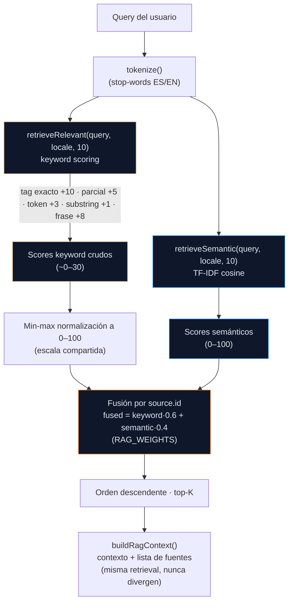
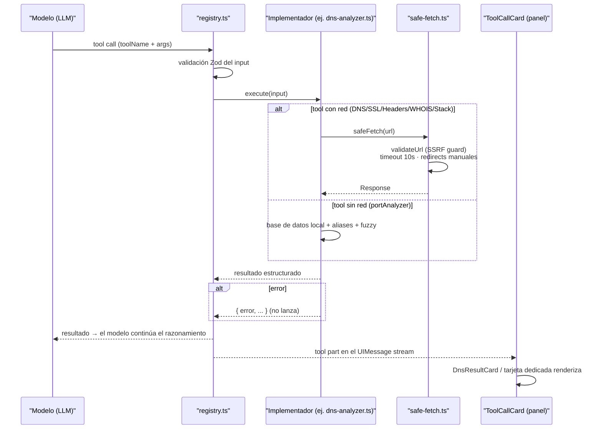

# Ask Juan AI — AI Cybersecurity Copilot

> Documento técnico del copilot integrado en el portfolio. Fuente de verdad de la arquitectura vigente: `README.md` (visión general) y `CONTEXT.md` (glosario de seams). Este doc profundiza en **el prompt, las tools y los tests golden** — las tres piezas que definen qué sabe y qué puede hacer el copilot.

**Ruta:** `POST /api/ask-ai` — streaming vía Vercel AI SDK v7 (`useChat` + `DefaultChatTransport` + `streamText` + `toUIMessageStreamResponse`).

---

## 1. Visión General del Pipeline

```
POST /api/ask-ai?lang={es|en}&mode={ask|analyze|osint|services|contact}
  │
  ├─ 1. Validación Zod        → messages ≤ 50 · memoryContext ≤ 3000 · skipModels ≤ 5
  ├─ 2. Rate limit            → checkRateLimit(clientId, 10/60s)  [429 + Retry-After]
  ├─ 3. RAG                   → buildRagContext(query, lang, topK=5)
  ├─ 4. Prompt                → buildSystemPrompt({ language, mode, ragContext, sources, memoryContext })
  ├─ 5. Model pool            → streamWithFallback(pool free-only → 503 si todo falla)
  └─ 6. Stream (SSE)          → UIMessage stream → render Markdown incremental
                                └─ onFinish → summarizeConversation → addSummary (memoria)
```

Tres seams del server hacen todo el trabajo pesado:

| Pieza | Módulo | Rol |
|---|---|---|
| **Prompt** | `src/lib/ask-ai/prompt/system-prompt.ts` | Ensambla el system prompt bilingüe: headers, bloque RAG, memoria, reglas de comportamiento y guía de tools |
| **Tools** | `src/lib/ask-ai/tools/` | 6 herramientas pasivas con Zod schema + `safe-fetch` anti-SSRF |
| **RAG + corpus** | `src/lib/ask-ai/rag/` | Retrieval fusionado (keyword + TF-IDF) sobre el corpus proyectado per-locale |

---

## 2. El Prompt (`system-prompt.ts`)

Dos funciones puras (sin red, testeables):

### 2.1 `buildSystemPrompt(options)`

**Firma:**

```ts
interface BuildSystemPromptOptions {
  language: 'es' | 'en';
  mode: string;                    // ask | analyze | osint | services | contact
  ragContext: string;              // bloque RAG pre-formateado (o '')
  sources: { title: string }[];    // fuentes para la línea "fuentes disponibles"
  memoryContext?: string;          // bloque de memoria pre-localizado (o '')
}
```

**Estructura del prompt resultante (en orden):**

```
You are Ask Juan AI, an enterprise-grade Infrastructure & Cybersecurity Copilot…
EL USUARIO ESTÁ NAVEGANDO EN: ES|EN. Responde preferentemente en este idioma…
MODO ACTIVO: {MODE}

Role:
- AI Infrastructure & Cybersecurity Copilot
- Expert in IT/OT cybersecurity, industrial networks, IEC 62443, NIST CSF,
  SIEM, OSINT, cloud, networking and SaaS engineering.

[RAG block — solo si hay contexto recuperado]
Contexto del portfolio / Portfolio context
[FUENTE: {title}]
{content}
IMPORTANTE / IMPORTANT:
- Usa estas fuentes como base factual…
- Si no encuentras información en las fuentes, indícalo…
- No inventes certificaciones, empleadores, métricas o detalles personales…
- Si el usuario pregunta sobre servicios, experiencia o perfil, prioriza las fuentes.

Behavior:
- Responde en el idioma del usuario…
- No inventes datos personales, certificaciones o métricas…
- Para contactos, deriva a LinkedIn o la sección de contacto.

[Memory block — solo si memoryContext viene del cliente]
{memoryContext}   ← embebido verbatim, ya pre-localizado por el seam de memoria

[Tool guide — buildToolDescriptions(language)]
Guía de Selección de Herramientas / Tool Selection Guide
Lista de herramientas / Tool list
Reglas de Formato de Salida / Output Format Rules

[Fuentes disponibles / Available sources — solo si sources.length > 0]
Fuentes disponibles para esta consulta: {títulos, separados por coma}.
```

**Reglas de comportamiento clave que el prompt le impone al modelo:**
- Responder en el idioma del usuario (con la cabecera ES/EN del contexto).
- **No inventar**: certificaciones, empleadores, métricas o detalles personales solo si están en las fuentes.
- Priorizar las fuentes recuperadas para preguntas de perfil/servicios/experiencia.
- Contactos → LinkedIn o sección de contacto del sitio.

### 2.2 `buildToolDescriptions(language)`

Genera la guía de tools en el idioma pedido. Contiene tres bloques:

1. **Guía de selección** — cuándo usar cada tool (p. ej. "Usa `dnsAnalyzer` cuando el usuario pregunte sobre: registros DNS, enrutamiento de correo (MX), configuración DNS…").
2. **Lista de tools** — una línea por herramienta con su propósito.
3. **Reglas de formato de salida** — tablas para comparaciones, viñetas para pasos, code blocks solo para comandos, negrita para el hallazgo principal, y explicar errores de tools con alternativas.

> Las descriptions de las tools en el **registry** (`askAiTools`) también son bilingües-agnósticas (inglés técnico estándar); la **guía** en el prompt sí se localiza.

---

## 3. Las Tools (`src/lib/ask-ai/tools/`)

### 3.1 Registry — `registry.ts`

`askAiTools: ToolSet` exporta las 6 tools como objetos del SDK `ai`: `description` + `inputSchema` (Zod) + `execute`. Cada `execute` envuelve el implementador en try/catch y **devuelve un objeto de error estructurado** en vez de lanzar (el modelo recibe `{ error: string, ... }` y lo explica al usuario).

### 3.2 Las 6 herramientas

| Tool | Schema (inputs) | Qué devuelve | Implementación |
|---|---|---|---|
| `dnsAnalyzer` | `domain` (≤253), `recordTypes` opcional: `A/AAAA/MX/TXT/NS/CNAME` | Registros por tipo | `node:dns` promisificado (`dns-analyzer.ts`) |
| `sslChecker` | `hostname` (≤253), `port` (default 443) | Issuer, subject, validez, días restantes, SAN, protocolo | `node:tls` con timeout 10s (`ssl-checker.ts`) |
| `httpHeadersAnalyzer` | `url` (≤2048) | Estado + 8 headers de seguridad (HSTS, CSP, XFO, XCTO, XSS, Referrer-Policy, Permissions-Policy, CORS) + otros notables | `safeFetch` con `HEAD` (`http-headers.ts`) |
| `whoisLookup` | `domain` (≤253) | Registrar, fechas (registro/expiración/último cambio), name servers, status | RDAP vía `safeFetch`, multi-servidor en secuencia (`whois-lookup.ts`) |
| `techStackDetector` | `url` (≤2048) | Server, framework, CDN, analytics, headers con hint | `safeFetch` GET + firmas de headers (`tech-stack-detector.ts`) |
| `portAnalyzer` | `service` (≤100) | Puertos del servicio con riesgo (low/medium/high/critical) y recomendación | Base de datos local + aliases + fuzzy search (`port-analyzer.ts`) |

**`portAnalyzer` es la única sin red**: consulta una base de datos interna de ~15 servicios (SSH, HTTP, RDP, SMB, DNS, MySQL, PostgreSQL, MSSQL, Telnet, FTP, SMTP, Docker, Kubernetes, **Modbus** e **IEC 61850** — los OT) con riesgo y recomendación de hardening. Incluye aliases (`scada` → modbus, `substation` → IEC 61850).

### 3.3 `safe-fetch.ts` — capa anti-SSRF

Todas las tools que tocan red pasan por `safeFetch()`:

- **Validación sintáctica** (`validateUrl`, sync): solo `http:`/`https:`, bloqueo de hostnames (`localhost`, `localhost.localdomain`, `127.0.0.1`, `0.0.0.0`, `metadata.google.internal`, `169.254.169.254`) y de **rangos de IP privadas** (127/8, 10/8, 172.16/12, 192.168/16, 0/8, 169.254/16, CGNAT 100.64/10, benchmark 198.18/15, ::1, fc00:/7, fe80:/10, IPv6 con corchetes e IPv4-mapped `::ffff:`).
- **Validación con DNS** (`validateUrlResolved`, async, usada por `safeFetch`): resuelve el hostname y re-chequea **cada** IP resuelta contra los rangos privados — bloquea FQDNs que resuelven a loopback/privado (`localhost.localdomain`, `127.0.0.1.nip.io`). Fallo de resolución → fail-closed. La resolución es inyectable para tests.
- **Timeout** por defecto 10s (AbortController).
- **Redirects manuales** (`redirect: 'manual'`) con re-validación de cada salto.
- **`extractDomain`**: normaliza input del usuario (agrega `https://` si falta) y valida formato de dominio.

> La protección SSRF fue verificada por tests en `src/lib/ask-ai/tools/__tests__/safe-fetch.test.ts`.

---

## 4. Tests Golden — qué protegen

Los golden tests son la red de seguridad del copilot: definen **qué debe rankear primero** para las preguntas clave del portfolio y detectan cualquier regresión del corpus o del scoring. Viven en `src/lib/ask-ai/rag/retriever.test.ts`.

### 4.1 Los golden de ranking

| Query | Locale | Expectativa | Qué protege |
|---|---|---|---|
| `IEC 62443 seguridad industrial` | es | `compliance-iec62443` **#1** | El estándar debe ganar sobre el blog del mismo tema |
| `¿Qué es IEC 62443?` | es | `compliance-iec62443` en **top-2** | Limitación conocida documentada: TF-sin-IDF prefiere el doc corto (blog) por 1 punto |
| `Qué cubre IEC 62443` (sin ¿) | es | `compliance-iec62443` en **top-2** | Regresión del artefacto `qué` ⊂ `neuquén` (stop-words) |
| `PMP certification` | en | `certs-main-en` **#1** | El corpus per-locale (C2) resuelve la entrada EN |
| `perfil profesional` / `professional profile` | es/en | **cero** fuentes del otro locale | El filtro por idioma nunca filtra |
| `el la y de en` (solo stop-words) | es | **vacío** | Sin señal de retrieval → sin contexto RAG |

### 4.2 Tests de invariantes del scoring

| Invariante | Test |
|---|---|
| Ranking descendente | `score[i-1] >= score[i]` para toda query |
| Fórmula de fusión | `score = keywordScore·0.6 + semanticScore·0.4` (dentro de 0.1) |
| Normalización | `keywordScore` en 0–100 y `score` ≤ 100; el top hit de keyword (tag match "siem") llega al techo (100) |
| Fusión semantic-only | Fuentes que solo encuentra TF-IDF entran con `keywordScore=0` (min-max mapea el mínimo a 0) |
| `buildRagContext` | El contexto y la lista de fuentes **siempre** salen de la misma retrieval (mismo orden, mismo contenido) |

### 4.3 Otros tests que protegen el copilot

| Archivo | Cubre |
|---|---|
| `rag/tokenizer.test.ts` | Tokenización y stop-words (incluidos interrogativos ES/EN acentuados) |
| `rag/sources.test.ts` | El corpus **proyectado** no drift: vectores SIEM verbatim, progresos de compliance, todos los jobs/posts, "20 años" del perfil, y la regla estructural (cero `both`, cada id `es` con su hermano `-en`) |
| `prompt/system-prompt.test.ts` | Guías ES/EN, las 6 tools en ambos idiomas, bloque RAG, línea de fuentes y `memoryContext` verbatim |
| `model-pool.test.ts` | Fallback real (read rechazado, SSE `{"type":"error"}`, stream vacío, `ModelPoolError`) + invariante free-only (`sanitizeFreePool`, pool vacío → throw) + metadata del modelo ganador con índice de intento (badge de fallback) + **cola de rate-limit** (429 → backoff 600ms→1200ms con jitter, máx. 2 reintentos, avance al agotarlos) + **regresión del modelo muerto** (el error llega tras los eventos sintéticos `start` → el pool cae al siguiente) |
| `api/ask-ai/route.test.ts` | Payload RAG en el system prompt (ES/EN), mode+tools, cap de `memoryContext` (3000), 400/429/503 |
| `memory/*.test.ts` | `summarizeConversation`, hook conector, persistencia y refresh de contexto |

---

## 5. Detalle del Scoring RAG

El retrieval es **puramente determinístico** (sin vector DB, sin embeddings externos):

### Keyword (`computeKeywordScore`) — pesos crudos

| Señal | Puntos |
|---|---|
| Tag exacto (`source.tags`) | +10 |
| Tag parcial (substring bidireccional) | +5 |
| Token presente en content | +3 |
| Substring en content | +1 |
| Frase exacta en title/content | +8 (boost final) |

### Semántico (TF-IDF)

- **TF** normalizado por longitud del documento (sin IDF — corpus pequeño, documentado como limitación).
- Similitud coseno entre el vector de la query y el de cada fuente; umbral `> 0.05`, score = `round(cosine·100)`.

### Fusión

1. `retrieveRelevant(query, locale, 10)` y `retrieveSemantic(query, locale, 10)` corren por separado.
2. Los scores keyword crudos se **min-max normalizan a 0–100** sobre los candidatos (los crudos son ~0–30, el semántico ya es 0–100 — sin normalización los pesos no significarían lo que dicen).
3. Se unen por `source.id`; cada fuente queda con `keywordScore` + `semanticScore`.
4. **Fused** = `keyword·0.6 + semantic·0.4` (`RAG_WEIGHTS`), redondeado a 1 decimal; orden descendente; top-K.

### Limitaciones conocidas (documentadas, no defects)

- **TF sin IDF** prefiere documentos cortos — por eso el blog IEC 62443 supera al estándar por 1 punto en queries "what is" (el golden top-2 lo fija).
- El corpus se escanea una vez por request (sin caché de retrieval) — deliberado: el corpus es pequeño (**52 fuentes: 26 es + 26 en**).

**Versión Mermaid del pipeline de scoring** (renderiza en GitHub):



---

## 6. Flujo de Ejecución de una Tool

```
Modelo decide usar dnsAnalyzer (via tool calling)
  → registry.ts: execute(input) → try/catch
      → dns-analyzer.ts: extractDomain() (valida/normaliza)
      → node:dns resolve*() con manejo de ENODATA/ENOTFOUND
  → resultado estructurado { domain, records[] }
  → tool part en el UIMessage stream
  → ToolCallCard renderiza DnsResultCard en el panel
  └─ error → { domain, records: [], error } → el modelo lo explica
```

**Versión Mermaid** (renderiza en GitHub):



Todas las tools son **pasivas** (solo lectura de datos públicos): no escanean activamente, no requieren autorización del usuario, y `portAnalyzer` ni siquiera toca la red — es educacional.

---

## 7. Referencias

| Tema | Ubicación |
|---|---|
| Prompt builder + tests | `src/lib/ask-ai/prompt/system-prompt.ts` · `system-prompt.test.ts` |
| Tools + registry + safe-fetch | `src/lib/ask-ai/tools/` · `__tests__/` |
| RAG (retriever/tokenizer/sources) + tests golden | `src/lib/ask-ai/rag/` |
| Model pool | `src/lib/ask-ai/model-pool.ts` · `model-pool.test.ts` — **free-only por invariante** (sin fallback pago; pool vacío → 503) · health-check persistido en `pool-health.ts` (localStorage, TTL 24h) |
| Memoria | `src/lib/ask-ai/memory/` |
| Ruta | `src/app/api/ask-ai/route.ts` · `route.test.ts` |
| Glosario de seams | `CONTEXT.md` |
| Visión general + diagramas | `README.md` |
